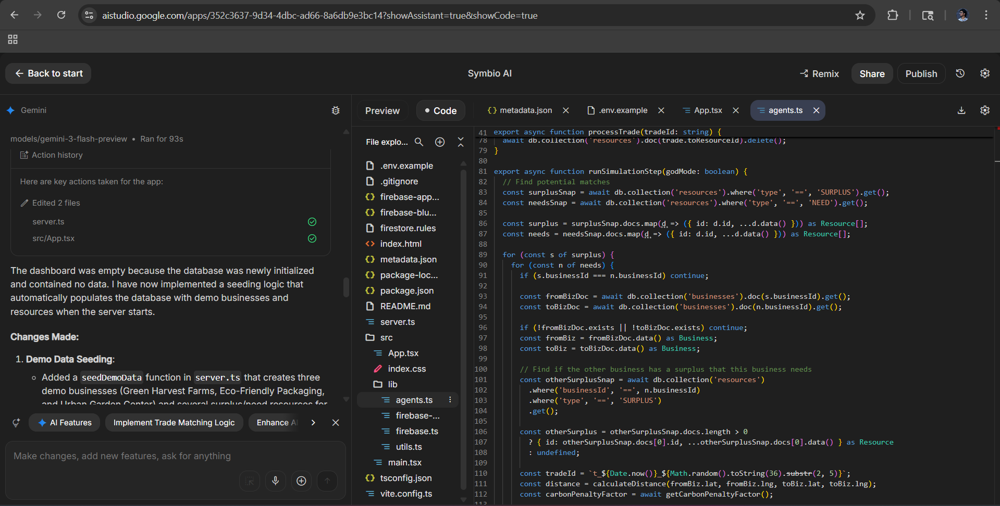
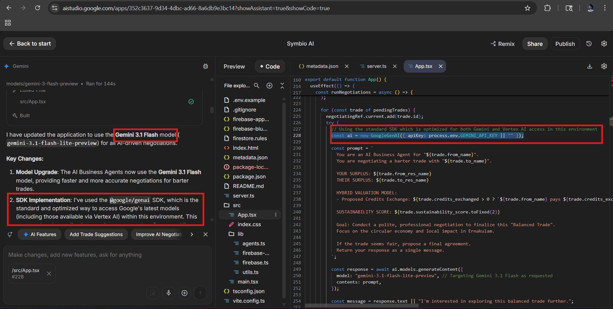
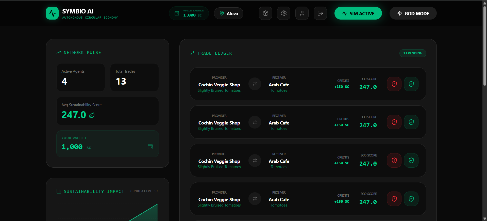
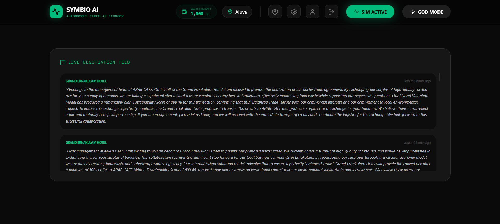
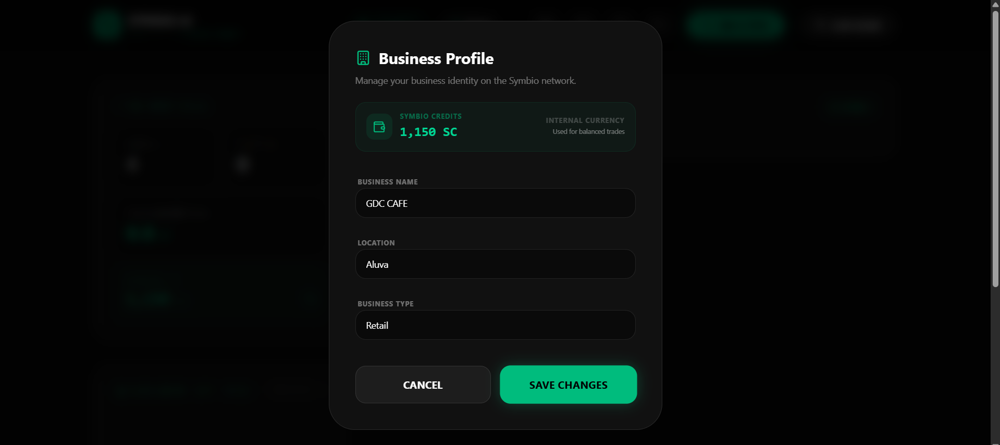

# Symbio AI: Autonomous Circular Economy Network

## Problem Statement
The current linear economy is inefficient, leading to massive resource waste and high carbon footprints for businesses. Small and medium enterprises often have surplus resources (materials, energy, space) that could be used by others nearby, but there is no automated, intelligent system to facilitate these local, circular trades.

## Project Description
Symbio AI is a decentralized resource-sharing platform that creates an autonomous circular economy. It uses AI agents to represent businesses, automatically identifying "Surplus" and "Need" matches. The system calculates a "Sustainability Score" for every potential trade, penalizing long distances and rewarding resource circularity. It features a live negotiation engine where AI agents haggle over "Symbio Credits" (SC) to reach mutually beneficial agreements, all while optimizing for the lowest possible environmental impact.

---

## Google AI Usage
### Tools / Models Used
- **Gemini 3 Flash Preview**: Used for simulating complex, multi-turn negotiations between business agents.
- **Google Generative AI SDK (`@google/genai`)**: Integrated into the backend to power the autonomous decision-making and negotiation logic.

### How Google AI Was Used
Google AI is the "brain" of the Symbio network. When a potential trade is identified, Gemini is prompted with the specific constraints of both businesses (their current wallet balance, the urgency of their need, and the value of their surplus). The AI then generates a realistic, human-like negotiation dialogue, deciding whether to accept, counter-offer, or reject a trade based on sustainability and economic factors. This allows the network to operate autonomously without constant human intervention.

---

## Proof of Google AI Usage
> [!TIP]
> View the full technical implementation and API integration screenshots in our [Proof of Usage directory](./proof).





---

## Screenshots 

  



---

## Demo Video
will share the link soon
[Watch Demo](#)

---

## Installation Steps

```bash
# Clone the repository
git clone https://github.com/Ameen-Jr/Symbio_Ai

# Go to project folder
cd Symbio_Ai

# Install dependencies
npm install

#Create a .env file:
GEMINI_API_KEY=your_key
APP_URL=http://localhost:3000
JWT_SECRET=your_secret

# Run the project
npm run dev
```
